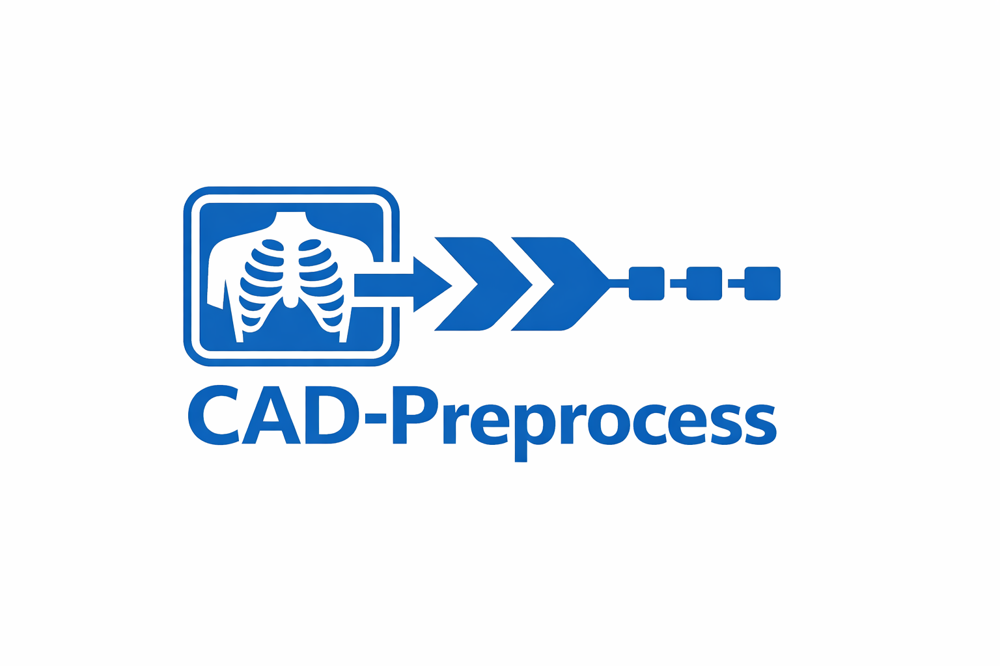

<p align="center">
  
</p>

<h3 align="center">CAD Preprocess</h3>

<p align="center">
  A Python library for DICOM preprocessing in Computer-Aided Detection/Diagnosis systems.
  <br>
  <a href="https://harshil-anuwadia.github.io/cad-preprocess/"><strong>Documentation</strong></a> ·
  <a href="https://harshil-anuwadia.github.io/cad-preprocess/docs/api/index.html">API Reference</a> ·
  <a href="https://harshil-anuwadia.github.io/cad-preprocess/docs/examples.html">Examples</a>
</p>

<p align="center">
  
  
  
</p>

---

## Overview

CAD Preprocess standardizes DICOM image preprocessing for machine learning pipelines. Write your preprocessing logic once, use it identically across training, inference, and production environments.

**Key capabilities:**

- **Reproducible preprocessing** — Configuration hashing ensures identical results between training and inference
- **DICOM handling** — Automatic file discovery, validation, and metadata extraction  
- **Flexible output** — PNG, JPEG, or NumPy arrays with configurable naming policies
- **Profile-based metadata** — Extract minimal, patient, geometry, ML, or acquisition metadata
- **Dual interface** — Use as a Python library or command-line tool

## Installation

```bash
# Clone and install
git clone https://github.com/Harshil-Anuwadia/cad-preprocess.git
cd cad-preprocess
pip install -e .

# Or install dependencies manually
pip install pydicom numpy Pillow PyYAML scikit-image
```

## Usage

### Command Line

```bash
# Basic usage
cad-preprocess -i ./dicoms -o ./output

# With configuration file
cad-preprocess -i ./dicoms -o ./output -c config.yaml

# ML-focused metadata extraction
cad-preprocess -i ./dicoms -o ./output --metadata-profile ml

# Custom CT windowing
cad-preprocess -i ./dicoms -o ./output --window-center 40 --window-width 400

# Preview without processing
cad-preprocess -i ./dicoms -o ./output --dry-run
```

### Python API

```python
from cad_preprocess import preprocess, CADPreprocessor

# Quick single-file processing
result = preprocess("scan.dcm", "output/")
print(f"Processed: {result.sop_instance_uid}")
print(f"Shape: {result.image.shape}")

# Batch processing with configuration
processor = CADPreprocessor.from_config("config.yaml")
results = processor.process_directory("dicoms/", "output/")

# Get config hash for reproducibility tracking
print(f"Config hash: {processor.config_hash}")
```

### Configuration

```yaml
# config.yaml
preprocessing:
  windowing:
    strategy: fixed_window
    window_center: 40
    window_width: 400
  normalization: min_max
  resizing:
    target_height: 512
    target_width: 512
    preserve_aspect_ratio: true

metadata:
  profiles:
    - minimal
    - ml

output:
  naming_policy: sop_instance_uid
  format: png
```

## Output Structure

```
output/
├── images/
│   ├── 1.2.840.113619.2.55.3.png
│   └── ...
├── metadata/
│   ├── 1.2.840.113619.2.55.3.json
│   └── ...
├── logs/
│   └── processing_log.json
└── manifest.json
```

## CLI Reference

| Option | Description |
|--------|-------------|
| `-i, --input` | Input DICOM file or directory |
| `-o, --output` | Output directory |
| `-c, --config` | YAML configuration file |
| `-m, --metadata-profile` | Metadata profile: minimal, patient, geometry, ml, acquisition, all |
| `--window-center` | CT window center value |
| `--window-width` | CT window width value |
| `--target-size` | Output image dimensions |
| `--overwrite` | Overwrite existing output files |
| `--dry-run` | Preview files without processing |
| `-l, --log-level` | Logging verbosity: debug, info, warning, error |

## Requirements

| Package | Version |
|---------|---------|
| Python | >= 3.9 |
| pydicom | >= 2.3.0 |
| numpy | >= 1.21.0 |
| Pillow | >= 9.0.0 |
| PyYAML | >= 6.0 |
| scikit-image | >= 0.19.0 |

## Project Structure

```
cad-preprocess/
├── src/cad_preprocess/
│   ├── cli.py                  # Command-line interface
│   ├── config.py               # Configuration management
│   ├── input_handler.py        # DICOM discovery & validation
│   ├── preprocessing_engine.py # Image processing pipeline
│   ├── metadata_extractor.py   # Metadata extraction
│   ├── output_writer.py        # File output handling
│   ├── logging_utils.py        # Logging & statistics
│   └── integration.py          # High-level API
├── tests/                      # Unit tests
├── docs/                       # Documentation website
└── pyproject.toml
```

## License

This project is licensed under the MIT License. See [LICENSE](LICENSE) for details.

## Links

- [Documentation](https://harshil-anuwadia.github.io/cad-preprocess/)
- [API Reference](https://harshil-anuwadia.github.io/cad-preprocess/docs/api/index.html)
- [Examples](https://harshil-anuwadia.github.io/cad-preprocess/docs/examples.html)
- [Contributing](https://harshil-anuwadia.github.io/cad-preprocess/docs/contributing.html)
